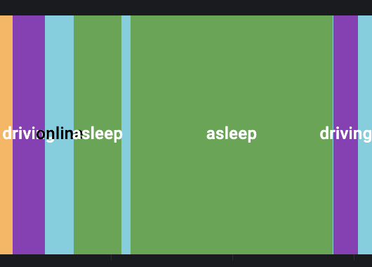
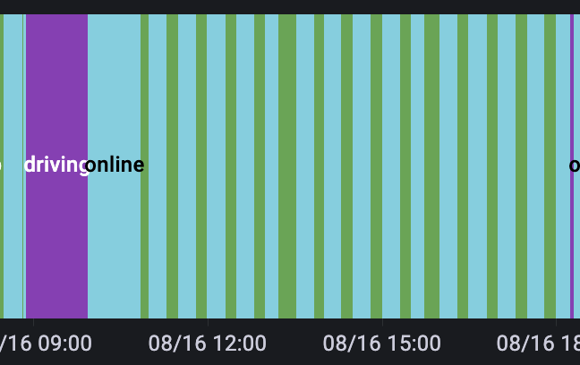

# Tesla-Sauron
블랙박스 사용이나 12v 배터리 방전을 막기위해 주기적으로 차량을 깨워주는 bot입니다.
이 봇을 사용함에 있어 생기는 모든 책임은 사용자에게 있습니다.

### 무슨 용도인가요?
테슬라에는 고전압배터리와 저전압배터리(AKA 12v배터리) 두가지 배터리가 들어있습니다.
저전압 배터리는 차량이 깨어있을때(online) 고전압 배터리를 통해 충전됩니다.
테슬라는 알아서 주기적으로 저전압 배터리를 충전합니다.
내부 시거잭, usb 등 전장류는 차량이 online일때, 이 저전압 배터리를 통해 전원을 공급받습니다.
전기를 많이 사용하는 sentry모드나 캠핌모드 등을 사용하지 않는이상,
주차시 테슬라는 offline/sleep 모드에 들어갑니다.

이 봇을 통해서 아래 두가지를 할 수 있습니다.
1. 저전압 배터리를 좀 더 자주 충전하기
2. 내부 전장류(시거잭, usb포트)를 좀 더 자주 활성화하기

### 구체적 활용 예
1. 블랙박스를 저전압(12v) 배터리에 직결했을때, 저전압 배터리가 방전되는 현상을 방지
2. 블랙박스를 보조배터리 -> 시거잭을 통해 연결하는 경우, 보조배터리가 방전되는 현상을 방지

### 사용 방법
1. 24시간 돌릴수 있는 서버나 집에 남는 컴퓨터를 준비합니다.
2. [docker](docker.com) [docker-compose](docker-compose.com)를 설치합니다. 
3. [tesla-api generator](https://tesla-info.com/tesla-token.php) 등을 통하여 테슬라 OAuth 토큰을 준비합니다. (유출되지 않도록 주의)
4. /src/tesla_token.json에 준비한 OAuth토큰의 `access_token`, `refresh_token`을 입력합니다.
5. /src/main.py를 열어 13-14라인에 자신이 차량을 깨우고 싶은 주기를 입력합니다.
6. 프로젝트를 다운받아 아래 커멘드를 실행합니다. 
```bash
$ docker-compose up -d
```

### 사용시
| 상태 | 이미지 |
| -- | -- |
| 사용전 |  |
| 사용후 |  |